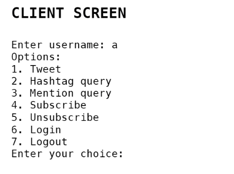
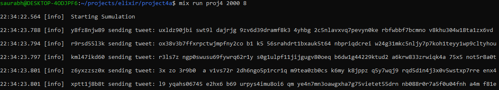
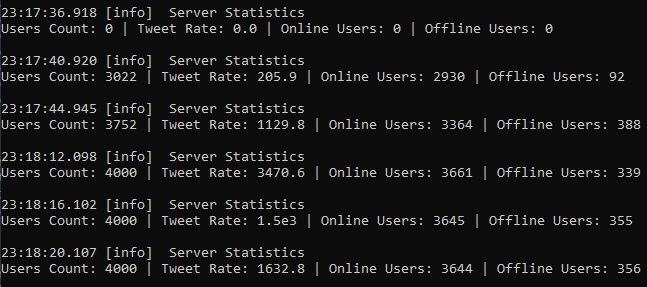
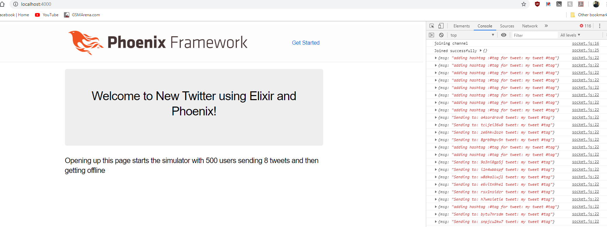

# Twitter Engine using Web Sockets
## Objective:
### To design a scalable, client-server based twitter clone with phoenix framework & TCP sockets where it offers all the twitter functionalities and build a simulation model to demonstrate these functionalities.


## Introduction:
**Elixir Actor modeling**

The actor model is a conceptual model to deal with concurrent computation. It defines some general rules for how the system’s components should behave and interact with each other. An actor is the primitive unit of computation. The idea is very similar to what we have in object-oriented languages. The main difference is that actors are completely isolated from each other and they will never share memory. It’s also worth noting that an actor can maintain a private state that can never be changed directly by another actor. Actors communicate with each other by sending asynchronous messages. Those messages are stored in other actors' mailboxes until they're processed. All this makes it superior to threads for running any kind of simulation.

**WebSockets**

WebSockets is an advanced technology that allows real-time interactive communication between the client browser and a server. It uses a completely different protocol that allows bidirectional data flow, making it unique against HTTP.

**Functionalities**

The various functionalities implemented in this project-
1. Register account and delete account
2. Send tweet. Tweets can have hashtags (e.g. #COP5615isgreat) and mentions
(@bestuser). You can use predefines categories of messages for hashtags.
3. Subscribe to user's tweets.
4. Re-tweets (so that your subscribers get an interesting tweet you got by other
means).
5. Allow querying tweets subscribed to, tweets with specific hashtags, tweets in
which the user is mentioned (my mentions).
6. If the user is connected, deliver the above types of tweets live (without querying).

## Steps To Run
In the project Directory open Console and execute below steps-
(Optional Step to get dependencies): mix deps.get

To Run the simulator from browser
```
Step 1: mix phx.server
Step 2: Open the browser and open- localhost:4000
```
To run the simulator from console (without GUI)
```
Step 1 Start Server: mix run proj4
Step 2 Start Simulator: mix run proj4 num_user num_msg
Note: run step 2 on another console
```
This runs the simulation model. Num_msg is the no of tweet each user will make. Ever user will henceforth stop tweeting and get offline. Decreasing active users and increasing the number of offline users

To start an interactive twitter user -
```
mix run proj4 user
```
If you choose this option, then it will first promt for username and then once u enter it, it will present various options-



<br>
Follow the onscreen commands to perform various tasks
Note: The default port chosen is 5000 and it runs on local host 127.0.0.1

## Libraries used
Social_parser to parse tweets and extract hashtags mentions etc.

Poison for sending and receiving data as JSON

PhoenixChannelClient for phoenix web framework

## Implementation
### Components-
**Socket**

Phoenix server creates a socket and ServerChannel.ex creates channel which can be joined using PhoeixChannel join method, Client sends messages to server which are handled by handle_in.
The client on browser handles the reply of server using channel.on

**Server**

Open tcp port and accepts and serves new connection. Routes messages from user to these specific functional modules –
-	Authentication Service: New Registration, Login, Logout
-	Operation Service: Twitter functionalities- send tweet, handle hashtags, handle mentions, news feed.
-	Persistence Service: All ets tables created and accessed from here. Easy to replace by database in future
-	Subscription Service: subscribe, unsubscribe, bulk subscribe
-	Stats Service: prints server stats at regular interval, maintains count of items

**User**

requests connection from server. Sends tweets with hashtag, mentions, retweets on incoming tweets from subscribers.
-	User Simulation- class that creates multiple Users and simulates mocks a real behavious of users. Send random tweets as many as num_msg to subscribers. Comes online and goes offline.
-	User Operations- routes messages of user to server via one single interface

**Proj4**

The Driver class. Takes console input initializes nodes and starts server/simulation/user

### Creating the Network of Twitter Users

Create the user (actors) based on console input and simulate real social network by having a zipf distribution.

Zipf distribution on the number of subscribers While creating simulated clients a zipf distribution gives a value based on zipf probability logic. This is the no of subscribers of that simulated user which gets set before starting the twitter functions
```
defp zipf_constant(users) do
  # c = (Sum(1/i))^-1 where i = 1,2,3....n
  users = for n <- 1..users, do: 1 / n
  :math.pow(Enum.sum(users), -1)
  end

defp zipf_prob(constant, user, users) do
  # z=c/x where x = 1,2,3...n
  round(constant / user * users)
end
```
This ensures that a small percentage of Users has very large number of subscribers and the remaining Users have standard number of subscribers.

### Simulating Online/Offline behaviour
Simulate periods of live connection and disconnection for users.

The main class starts the UserSimulation Module. In this the simulation_client function called from simulator start method runs in infinite loop till the user has completed tweeting the given number of times(num_msg) In each loop it calls simulate_logout which logs out user and then relogin after some time. I kept three frequency modes to keep it more random. This happens for each simulated user which results in random connection and disconnection of users. It can be observed from the fluctuations of online and offline users printed in server stats every 4 seconds.

## Working Examples-



Server Statistics:


Creating a user and sending tweet with hashtag #tag
Adding to feed for user when its offline




## Performance:
Each client is a separate actor and the server delegate the tasks to specific genservers.
Thus parallel processing has been utilized. The TCP socket has limit of 1000 conections but by sharing connections with multiple users many users can be concurrently handled.
Tested the system stability for 700 nodes.

## Unit Testing:
Several Unit test and functional test cases covering all the twitter functionalities are written.
It can be used to run specific components of the application.

Run all test cases with
```mix run```

### Example Scenarios-
- Operations Test (operation_service_test.exs)
  - Test sending 1 tweet with 1 subscriber
  - Sending tweet when user has no subscribers
  - Sending tweet when users has many subscribers
  - Sending tweet with hashtag test number of tweets associated
  - Sending tweet with hashtag test exact tweets
  - Multiple users using same hashtag. Tweets should be aggregated
  - Mentions in tweet
  - Multiple user mentioning same user in their tweets
- Persistence Test (persistence_service_test.exs)
  - Insert record in ETS
  - Update counter in ETS
  - Find user in ETS
- Stats Test (stats_service_test.exs)
  - Increase tweet count
  - Increase user count


